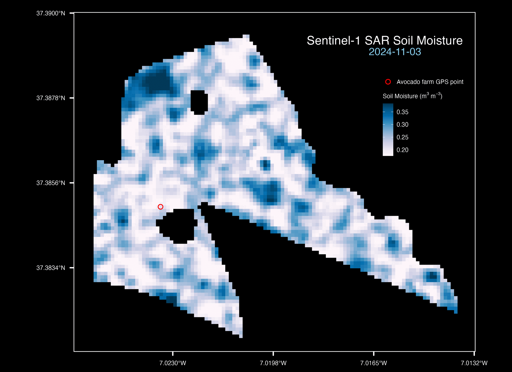

# Animated Sentinel-1 SAR Soil Moisture Map

This R script generates professional static maps, with a structure that can be easily extended to create animated GIF. The animated map below represent soil moisture estimated from high resolution Sentinel-1 SAR data. 

If you are interested to read the complete step-by-step, open-source workflow 𝖿𝗈𝗋 𝖾𝗌𝗍𝗂𝗆𝖺𝗍𝗂𝗇𝗀 𝖿𝗂𝖾𝗅𝖽-𝗌𝖼𝖺𝗅𝖾 𝗌𝗈𝗂𝗅 𝗆𝗈𝗂𝗌𝗍𝗎𝗋𝖾 𝗎𝗌𝗂𝗇𝗀 𝗁𝗂𝗀𝗁-𝗋𝖾𝗌𝗈𝗅𝗎𝗍𝗂𝗈𝗇 𝖲𝖾𝗇𝗍𝗂𝗇𝖾𝗅-𝟣 𝖦𝖱𝖣 𝖲𝖠𝖱 𝖽𝖺𝗍𝖺, check-out this: 👉 [Sentinel-1 Soil Moisture](https://github.com/aanwarigeo/sentinel-1-soil-moisture).

